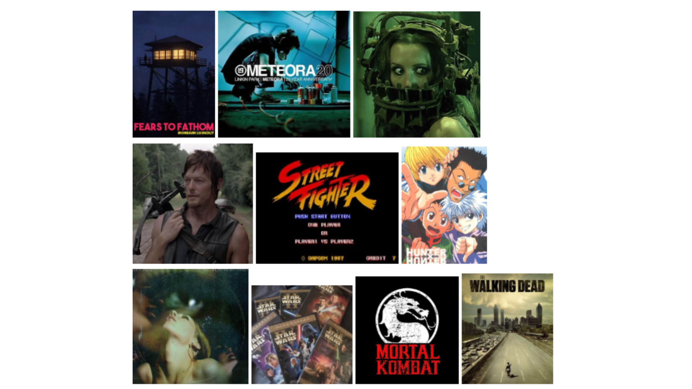

# me-in-markdown

Dear Mr. Aiello,

My name is **Rita Zakaryan,** and I am a **10th grade student.** I have many different interests, including <u>reading, anime, Star Wars, and video games.</u> One of my favorite movies is Saw 3D because it features Chester Bennington, the lead singer of my favorite band, Linkin Park. I also really enjoy the Saw franchise because of its unexpected plot twists and the way each movie keeps you guessing. My favorite book series is *Better Than the Movies* because it is a funny romantic comedy that I really enjoy reading. My favorite shows are The <u>Walking Dead, Cobra Kai, Breaking Bad, Dexter, and You.</u> Some of my favorite video games are <u>Street Fighter, Mortal Kombat, Resident Evil, Red Dead Redemption, Fears to Fathom, and Roblox.</u> One accomplishment that I am especially proud of is **earning straight As** during my second semester of 9th grade. I worked hard for those grades, so seeing that my effort paid off made me really happy. Something interesting about me is that I listen to a lot of rock, metal, and grunge music.

Some of my favorite bands are:

- The Neighbourhood
- Linkin Park
- Chevelle
- Pantera 
- Deftones
- The Offspring
- Nirvana

[Here is my playlist](https://open.spotify.com/playlist/6sn4CropOyhxaa35WGDK01?si=wN5Xpym7TTKYe_4ad9ePAA&utm_source=copy-link)

 People are often surprised when they find this out because I do not necessarily look like someone who listens to those genres.

This summer, I had a lot of fun experiences and made some great memories. I went on a cruise to **Mexico** and **Catalina Island,** where I met many new people and made friends who I still remember. One of my favorite memories was going to the Americana with my friend Sophia and getting food at the Cheesecake Factory. I also got to participate in Vardavar, an **Armenian** tradition where people celebrate by throwing water at each other. I did not travel to Armenia for it, but I went to a local event where the tradition was celebrated, and it was really fun. Recently, I have also been trying to join **cross country** because I enjoy running and wanted to try something new. I like to doodle whenever I have the chance, especially anime characters or random characters that I create in my imagination. Another experience I enjoyed was babysitting children. I really enjoy taking care of kids, and it made me realize how much patience and responsibility can mean when caring for someone else. <u>I also love animals, especially my cat, Pumpkin. She is basically my best friend, and I love her so much.</u>

As I start 10th grade, I have a few goals that I want to accomplish this year. I want to <u>make new friends, maintain good grades, and continue trying new activities that help me grow.</u> My experiences have also helped me think more about what I want to do in the future. Right now, I am interested in going into the medical field, possibly becoming a *CRNA,* because I love the idea of helping people and being able to make a difference in their lives. I know that my plans may change as I get older, but I want to continue exploring my interests and learning more about myself. I am excited to see what this school year brings and hope to make it a year filled with new experiences, accomplishments, and memories.

Sincerely,

Rita Zakaryan

